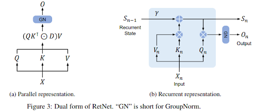
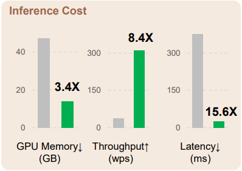

# Retention Networks Explained: A basic study of retention networks

The paper introduces the Retentive Network (RetNet), which is designed to address (claims) some of the limitations of the Transformer architecture, particularly in the context of large language models. The key advantages of RetNet over traditional Transformers are centered around its ability to achieve training parallelism, good performance, and low inference cost simultaneously, which the authors refer to as the "impossible triangle."

Multi-Scale Retention Mechanism: RetNet introduces a multi-scale retention mechanism as a substitute for the multi-head attention mechanism used in Transformers. This mechanism supports three computation paradigms:
Parallel Representation: Facilitates training parallelism, fully utilizing GPU devices for efficient training.
Recurrent Representation: Enables efficient O(1) inference in terms of memory and computation, significantly reducing deployment cost and latency. This representation also simplifies implementation by eliminating the need for key-value cache tricks.

Performance and Efficiency:
Inference Efficiency: RetNet demonstrates length-invariant inference cost. For instance, with a 7B model and 8k sequence length, RetNet decodes 8.4 times faster and saves 70% of memory compared to Transformers.
Training Efficiency: During training, RetNet achieves 25-50% memory saving and 7 times acceleration compared to the standard Transformer. It also shows advantages over highly-optimized variants like FlashAttention.

