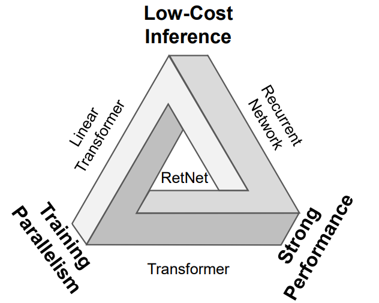

# Retention Networks Explained: A basic study of retention networks

The paper introduces the Retentive Network (RetNet), which is designed to address (claims) some of the limitations of the Transformer architecture, particularly in the context of large language models. The key advantages of RetNet over traditional Transformers are centered around its ability to achieve training parallelism, good performance, and low inference cost simultaneously, which the authors refer to as the "impossible triangle."

